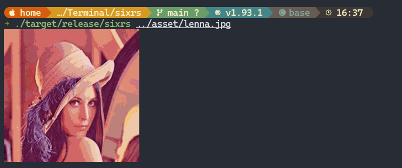

# sixrs

`sixrs` is a fast command line tool for displaying images in terminals. It uses
Sixel when available and can fall back to a Unicode half-block renderer in
terminals that do not support Sixel.



It supports common image formats through Rust's `image` crate, plus predictable
low-overhead raw pixel input paths:

- JPEG, PNG, GIF, BMP, ICO, TIFF, WebP, and PPM/PAM/PGM/PBM files
- raw RGB bytes from stdin
- raw RGBA bytes from stdin, with fully transparent pixels skipped

## Install

Install the published crate from crates.io:

```bash
cargo install sixrs
```

Upgrade an existing install:

```bash
cargo install sixrs --force
```

Or install from a local checkout:

```bash
cargo install --path .
```

You can also run it directly from a checkout:

```bash
cargo run --release -- --help
```

## Usage

Encode an image:

```bash
sixrs --input image.jpg
```

The input path can also be passed positionally:

```bash
sixrs image.png
```

Encode raw RGB pixels from stdin:

```bash
sixrs --raw-rgb 800 480 < frame.rgb
```

Encode raw RGBA pixels from stdin:

```bash
sixrs --raw-rgba 800 480 < frame.rgba
```

Limit output size and palette:

```bash
sixrs frame.ppm --max-width 1200 --max-height 800 --max-colors 64 --newline
```

Force Unicode half-block output:

```bash
sixrs image.jpg --protocol blocks --max-width 100
```

When `blocks` output is used in an interactive terminal and `--max-width` is
not set, `sixrs` defaults to half of the terminal width.

## Options

```text
-i, --input PATH     Read an image from PATH (JPEG, PNG, GIF, BMP, TIFF, WebP, PPM)
    --raw-rgb W H    Read W x H raw RGB bytes from stdin
    --raw-rgba W H   Read W x H raw RGBA bytes from stdin
    --max-width N    Downscale to fit within N columns of pixels
    --max-height N   Downscale to fit within N rows of pixels
    --max-colors N   Palette size, clamped to 2..256 (default: 96)
    --protocol P     Output protocol: auto, sixel, blocks (default: auto)
    --newline        Print a trailing newline after output
    --cursor-mode M  Cursor handling: none, newline, restore (default: none)
    --no-cursor-fix  Alias for --cursor-mode none
    --cell-height N  Cell height for --cursor-mode restore
-h, --help           Show help
```

## Terminal Support

In `auto` mode, `sixrs` uses Sixel in terminals that are likely to support it,
such as Windows Terminal, WezTerm, mlterm, foot, or recent xterm builds with
Sixel enabled. In terminals that do not support Sixel, such as macOS
Terminal.app, it falls back to Unicode half-block output using `▀`, `▄`, and
`█`-style 24-bit ANSI colors.

You can force either renderer:

```bash
sixrs image.jpg --protocol sixel
sixrs image.jpg --protocol blocks --max-width 100
```

Environment overrides are also available:

```bash
SIXRS_FORCE_SIXEL=1 sixrs image.jpg
SIXRS_NO_SIXEL=1 sixrs image.jpg
```

By default, `sixrs` does not adjust the text cursor after writing a Sixel image.
This keeps output compatible with terminals and tmux panes that attach graphics
to the current cursor state in different ways. When stdout is redirected or
piped, cursor handling is always disabled so the Sixel stream stays clean.

If your terminal leaves the prompt too far below the image, try the conservative
newline mode first:

```bash
sixrs image.jpg --cursor-mode newline
```

Some terminals work well with restore mode, which saves the cursor at the image
origin, writes the image, restores the cursor, and then moves down by the
estimated text-row height:

```bash
sixrs image.jpg --cursor-mode restore --cell-height 16
```

Inside tmux, terminal pixel dimensions may be unavailable or reported
incorrectly. If you use restore mode in tmux, pass your terminal cell height
explicitly or set it once for a shell session:

```bash
export SIXRS_CELL_HEIGHT=16
```

Most terminal/font combinations land somewhere around 14-20 pixels.

## Performance

The following quick benchmark was run on a 256x256 JPEG test image
(`asset/lenna.jpg`) on macOS with `rustc 1.93.1`, `chafa 1.18.2`, and
`img2sixel 1.10.5`. Each command was run 100 times and wrote output to
`/dev/null`. Substitute any local image path if you do not keep this test image
in the repository.

| Tool | Command | Wall time | Output bytes |
| --- | --- | ---: | ---: |
| `sixrs` | `sixrs asset/lenna.jpg --max-colors 256` | 1.66s | 59,220 |
| `img2sixel` | `img2sixel -p 256 -w 256 -h 256 -E fast -S asset/lenna.jpg` | 1.64s | 121,993 |
| `chafa` | `chafa -f sixels --size 256x256 -c 256 --animate off asset/lenna.jpg` | 7.32s | 4,248,878 |

Benchmark commands:

```bash
cargo build --release

/usr/bin/time -p sh -c 'for i in $(seq 1 100); do sixrs asset/lenna.jpg --max-colors 256 >/dev/null; done'

/usr/bin/time -p sh -c 'for i in $(seq 1 100); do img2sixel -p 256 -w 256 -h 256 -E fast -S asset/lenna.jpg >/dev/null; done'

/usr/bin/time -p sh -c 'for i in $(seq 1 100); do chafa -f sixels --size 256x256 -c 256 --animate off asset/lenna.jpg >/dev/null; done'
```

These numbers are workload-specific. The tools make different quality,
dithering, palette, and compression tradeoffs, so treat the table as a
reproducible smoke benchmark rather than a universal ranking.
